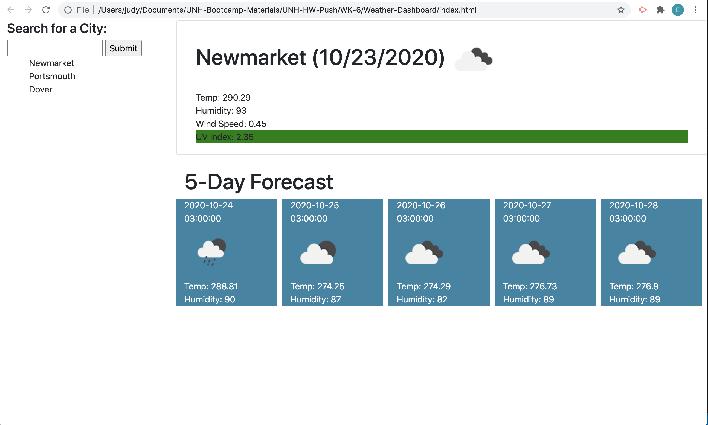

# Weather Dashboard

---------------------------------------- Personal Notes ----------------------------------------

DEPLOYED GITHUB PAGES LINK: https://eddiephi.github.io/Weather-Dashboard/

DESCRIPTION: I developed a Weather Dashboard app using HTML, CSS Bootstrap and jQuery Event Handling. The app displays the current weather conditions for a given area, as well as a 5-Day Forecast. Last searched City data are stored in local storage, and repopulate upon page reload.

The app gets JSON elements from https://openweathermap.org/api.

SCREENSHOT:

I used https://validator.w3.org/nu/ to validate my site.