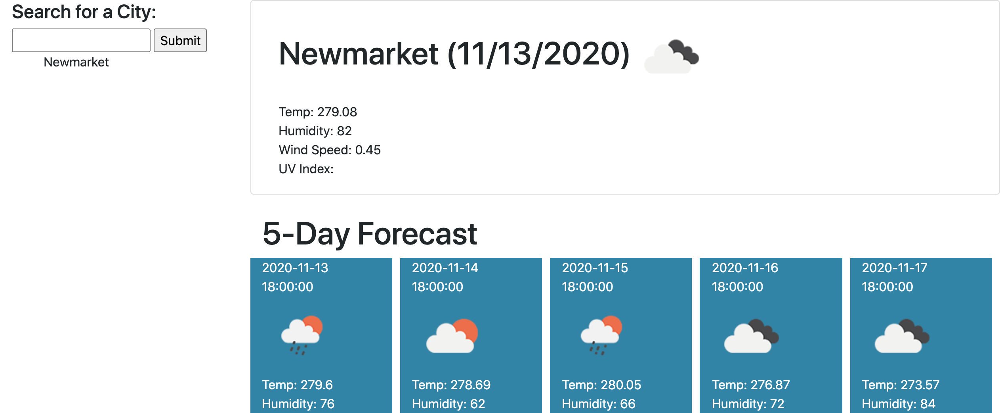

# Weather Dashboard

-------------------------------------------------- Personal Notes -------------------------------------------------

Deployed GitHub Pages Link: https://eddiephi.github.io/Weather-Dashboard/

Description: I developed a Weather Dashboard app using HTML, CSS Bootstrap and jQuery Event Handling. The app displays the current weather conditions for a given City, as well as a 5-Day Forecast. Last searched City data are stored in local storage, and repopulate upon page reload.

The app gets JSON elements from https://openweathermap.org/api.

Screenshot:

Technologies: HTML5, CSS3, Bootstrap, JavaScript, jQuery, Third-Party API

License: MIT

I used https://validator.w3.org/nu/ to validate my work.

---------------------------------------------------- Contact ----------------------------------------------------

Email: ephimansone@gmail.com 

LinkedIn: https://linkedin.com/in/eddiephi

GitHub: https://github.com/EddiePhi

Portfolio: https://eddiephi.github.io/EddiePhiPortfolio/